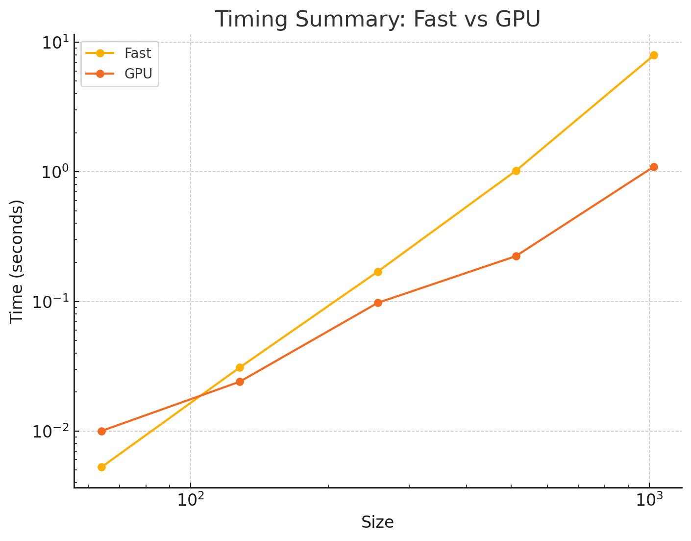

# MiniTorch Module 3


* Docs: https://minitorch.github.io/

* Overview: https://minitorch.github.io/module3.html


You will need to modify `tensor_functions.py` slightly in this assignment.

* Tests:

```
python run_tests.py
```

* Note:

Several of the tests for this assignment will only run if you are on a GPU machine and will not
run on github's test infrastructure. Please follow the instructions to setup up a colab machine
to run these tests.

This assignment requires the following files from the previous assignments. You can get these by running

```bash
python sync_previous_module.py previous-module-dir current-module-dir
```

The files that will be synced are:

        minitorch/tensor_data.py minitorch/tensor_functions.py minitorch/tensor_ops.py minitorch/operators.py minitorch/scalar.py minitorch/scalar_functions.py minitorch/module.py minitorch/autodiff.py minitorch/module.py project/run_manual.py project/run_scalar.py project/run_tensor.py minitorch/operators.py minitorch/module.py minitorch/autodiff.py minitorch/tensor.py minitorch/datasets.py minitorch/testing.py minitorch/optim.py

* Parallel Check:
```
MAP

================================================================================
 Parallel Accelerator Optimizing:  Function tensor_map.<locals>._map,
/Users/meiligupta/workspace/mod3-mwgupta/minitorch/fast_ops.py (163)
================================================================================


Parallel loop listing for  Function tensor_map.<locals>._map, /Users/meiligupta/workspace/mod3-mwgupta/minitorch/fast_ops.py (163)
---------------------------------------------------------------------------------------|loop #ID
    def _map(                                                                          |
        out: Storage,                                                                  |
        out_shape: Shape,                                                              |
        out_strides: Strides,                                                          |
        in_storage: Storage,                                                           |
        in_shape: Shape,                                                               |
        in_strides: Strides,                                                           |
    ) -> None:                                                                         |
        # TODO: Implement for Task 3.1.                                                |
        if np.array_equal(out_strides, in_strides) and len(in_storage) >= len(out):    |
            for i in prange(len(out)):-------------------------------------------------| #2
                out[i] = fn(in_storage[i])                                             |
        else:                                                                          |
            for i in prange(len(out)):-------------------------------------------------| #3
                out_index: Index = np.zeros(MAX_DIMS, dtype=np.int32)------------------| #0
                in_index: Index = np.zeros(MAX_DIMS, dtype=np.int32)-------------------| #1
                to_index(i, out_shape, out_index)                                      |
                broadcast_index(out_index, out_shape, in_shape, in_index)              |
                o = index_to_position(out_index, out_strides)                          |
                j = index_to_position(in_index, in_strides)                            |
                out[o] = fn(in_storage[j])                                             |
--------------------------------- Fusing loops ---------------------------------
Attempting fusion of parallel loops (combines loops with similar properties)...

Fused loop summary:
+--0 has the following loops fused into it:
   +--1 (fused)
Following the attempted fusion of parallel for-loops there are 3 parallel for-
loop(s) (originating from loops labelled: #2, #3, #0).
--------------------------------------------------------------------------------
---------------------------- Optimising loop nests -----------------------------
Attempting loop nest rewrites (optimising for the largest parallel loops)...

+--3 is a parallel loop
   +--0 --> rewritten as a serial loop
--------------------------------------------------------------------------------
----------------------------- Before Optimisation ------------------------------
Parallel region 0:
+--3 (parallel)
   +--0 (parallel)
   +--1 (parallel)


--------------------------------------------------------------------------------
------------------------------ After Optimisation ------------------------------
Parallel region 0:
+--3 (parallel)
   +--0 (serial, fused with loop(s): 1)


Parallel region 0 (loop #3) had 1 loop(s) fused and 1 loop(s) serialized as part
 of the larger parallel loop (#3).
--------------------------------------------------------------------------------
--------------------------------------------------------------------------------

---------------------------Loop invariant code motion---------------------------
Allocation hoisting:
The memory allocation derived from the instruction at
/Users/meiligupta/workspace/mod3-mwgupta/minitorch/fast_ops.py (177) is hoisted
out of the parallel loop labelled #3 (it will be performed before the loop is
executed and reused inside the loop):
   Allocation:: out_index: Index = np.zeros(MAX_DIMS, dtype=np.int32)
    - numpy.empty() is used for the allocation.
The memory allocation derived from the instruction at
/Users/meiligupta/workspace/mod3-mwgupta/minitorch/fast_ops.py (178) is hoisted
out of the parallel loop labelled #3 (it will be performed before the loop is
executed and reused inside the loop):
   Allocation:: in_index: Index = np.zeros(MAX_DIMS, dtype=np.int32)
    - numpy.empty() is used for the allocation.
None
ZIP

================================================================================
 Parallel Accelerator Optimizing:  Function tensor_zip.<locals>._zip,
/Users/meiligupta/workspace/mod3-mwgupta/minitorch/fast_ops.py (211)
================================================================================


Parallel loop listing for  Function tensor_zip.<locals>._zip, /Users/meiligupta/workspace/mod3-mwgupta/minitorch/fast_ops.py (211)
---------------------------------------------------------------------------|loop #ID
    def _zip(                                                              |
        out: Storage,                                                      |
        out_shape: Shape,                                                  |
        out_strides: Strides,                                              |
        a_storage: Storage,                                                |
        a_shape: Shape,                                                    |
        a_strides: Strides,                                                |
        b_storage: Storage,                                                |
        b_shape: Shape,                                                    |
        b_strides: Strides,                                                |
    ) -> None:                                                             |
        # TODO: Implement for Task 3.1.                                    |
        if (                                                               |
            np.array_equal(out_strides, a_strides)                         |
            and len(a_storage) >= len(out)                                 |
            and np.array_equal(a_strides, b_strides)                       |
            and len(b_storage) >= len(out)                                 |
        ):                                                                 |
            for i in prange(len(out)):-------------------------------------| #7
                out[i] = fn(a_storage[i], b_storage[i])                    |
        else:                                                              |
            for i in prange(len(out)):-------------------------------------| #8
                out_index: Index = np.zeros(MAX_DIMS, dtype=np.int32)------| #4
                a_index: Index = np.zeros(MAX_DIMS, dtype=np.int32)--------| #5
                b_index: Index = np.zeros(MAX_DIMS, dtype=np.int32)--------| #6
                to_index(i, out_shape, out_index)                          |
                o = index_to_position(out_index, out_strides)              |
                broadcast_index(out_index, out_shape, a_shape, a_index)    |
                j = index_to_position(a_index, a_strides)                  |
                broadcast_index(out_index, out_shape, b_shape, b_index)    |
                k = index_to_position(b_index, b_strides)                  |
                out[o] = fn(a_storage[j], b_storage[k])                    |
--------------------------------- Fusing loops ---------------------------------
Attempting fusion of parallel loops (combines loops with similar properties)...

Fused loop summary:
+--4 has the following loops fused into it:
   +--5 (fused)
   +--6 (fused)
Following the attempted fusion of parallel for-loops there are 3 parallel for-
loop(s) (originating from loops labelled: #7, #8, #4).
--------------------------------------------------------------------------------
---------------------------- Optimising loop nests -----------------------------
Attempting loop nest rewrites (optimising for the largest parallel loops)...

+--8 is a parallel loop
   +--4 --> rewritten as a serial loop
--------------------------------------------------------------------------------
----------------------------- Before Optimisation ------------------------------
Parallel region 0:
+--8 (parallel)
   +--4 (parallel)
   +--5 (parallel)
   +--6 (parallel)


--------------------------------------------------------------------------------
------------------------------ After Optimisation ------------------------------
Parallel region 0:
+--8 (parallel)
   +--4 (serial, fused with loop(s): 5, 6)


Parallel region 0 (loop #8) had 2 loop(s) fused and 1 loop(s) serialized as part
 of the larger parallel loop (#8).
--------------------------------------------------------------------------------
--------------------------------------------------------------------------------

---------------------------Loop invariant code motion---------------------------
Allocation hoisting:
The memory allocation derived from the instruction at
/Users/meiligupta/workspace/mod3-mwgupta/minitorch/fast_ops.py (233) is hoisted
out of the parallel loop labelled #8 (it will be performed before the loop is
executed and reused inside the loop):
   Allocation:: out_index: Index = np.zeros(MAX_DIMS, dtype=np.int32)
    - numpy.empty() is used for the allocation.
The memory allocation derived from the instruction at
/Users/meiligupta/workspace/mod3-mwgupta/minitorch/fast_ops.py (234) is hoisted
out of the parallel loop labelled #8 (it will be performed before the loop is
executed and reused inside the loop):
   Allocation:: a_index: Index = np.zeros(MAX_DIMS, dtype=np.int32)
    - numpy.empty() is used for the allocation.
The memory allocation derived from the instruction at
/Users/meiligupta/workspace/mod3-mwgupta/minitorch/fast_ops.py (235) is hoisted
out of the parallel loop labelled #8 (it will be performed before the loop is
executed and reused inside the loop):
   Allocation:: b_index: Index = np.zeros(MAX_DIMS, dtype=np.int32)
    - numpy.empty() is used for the allocation.
None
REDUCE

================================================================================
 Parallel Accelerator Optimizing:  Function tensor_reduce.<locals>._reduce,
/Users/meiligupta/workspace/mod3-mwgupta/minitorch/fast_ops.py (268)
================================================================================


Parallel loop listing for  Function tensor_reduce.<locals>._reduce, /Users/meiligupta/workspace/mod3-mwgupta/minitorch/fast_ops.py (268)
---------------------------------------------------------------------|loop #ID
    def _reduce(                                                     |
        out: Storage,                                                |
        out_shape: Shape,                                            |
        out_strides: Strides,                                        |
        a_storage: Storage,                                          |
        a_shape: Shape,                                              |
        a_strides: Strides,                                          |
        reduce_dim: int,                                             |
    ) -> None:                                                       |
        # TODO: Implement for Task 3.1.                              |
        for i in prange(len(out)):-----------------------------------| #10
            out_index: Index = np.zeros(MAX_DIMS, dtype=np.int32)----| #9
            reduce_size = a_shape[reduce_dim]                        |
            to_index(i, out_shape, out_index)                        |
            o = index_to_position(out_index, out_strides)            |
            acc = out[o]                                             |
            for s in range(reduce_size):                             |
                out_index[reduce_dim] = s                            |
                j = index_to_position(out_index, a_strides)          |
                acc = fn(acc, a_storage[j])                          |
            out[o] = acc                                             |
--------------------------------- Fusing loops ---------------------------------
Attempting fusion of parallel loops (combines loops with similar properties)...
Following the attempted fusion of parallel for-loops there are 2 parallel for-
loop(s) (originating from loops labelled: #10, #9).
--------------------------------------------------------------------------------
---------------------------- Optimising loop nests -----------------------------
Attempting loop nest rewrites (optimising for the largest parallel loops)...

+--10 is a parallel loop
   +--9 --> rewritten as a serial loop
--------------------------------------------------------------------------------
----------------------------- Before Optimisation ------------------------------
Parallel region 0:
+--10 (parallel)
   +--9 (parallel)


--------------------------------------------------------------------------------
------------------------------ After Optimisation ------------------------------
Parallel region 0:
+--10 (parallel)
   +--9 (serial)


Parallel region 0 (loop #10) had 0 loop(s) fused and 1 loop(s) serialized as
part of the larger parallel loop (#10).
--------------------------------------------------------------------------------
--------------------------------------------------------------------------------

---------------------------Loop invariant code motion---------------------------
Allocation hoisting:
The memory allocation derived from the instruction at
/Users/meiligupta/workspace/mod3-mwgupta/minitorch/fast_ops.py (279) is hoisted
out of the parallel loop labelled #10 (it will be performed before the loop is
executed and reused inside the loop):
   Allocation:: out_index: Index = np.zeros(MAX_DIMS, dtype=np.int32)
    - numpy.empty() is used for the allocation.
None
MATRIX MULTIPLY

================================================================================
 Parallel Accelerator Optimizing:  Function _tensor_matrix_multiply,
/Users/meiligupta/workspace/mod3-mwgupta/minitorch/fast_ops.py (293)
================================================================================


Parallel loop listing for  Function _tensor_matrix_multiply, /Users/meiligupta/workspace/mod3-mwgupta/minitorch/fast_ops.py (293)
--------------------------------------------------------------------------------------|loop #ID
def _tensor_matrix_multiply(                                                          |
    out: Storage,                                                                     |
    out_shape: Shape,                                                                 |
    out_strides: Strides,                                                             |
    a_storage: Storage,                                                               |
    a_shape: Shape,                                                                   |
    a_strides: Strides,                                                               |
    b_storage: Storage,                                                               |
    b_shape: Shape,                                                                   |
    b_strides: Strides,                                                               |
) -> None:                                                                            |
    """NUMBA tensor matrix multiply function.                                         |
                                                                                      |
    Should work for any tensor shapes that broadcast as long as                       |
                                                                                      |
    ```                                                                               |
    assert a_shape[-1] == b_shape[-2]                                                 |
    ```                                                                               |
                                                                                      |
    Optimizations:                                                                    |
                                                                                      |
    * Outer loop in parallel                                                          |
    * No index buffers or function calls                                              |
    * Inner loop should have no global writes, 1 multiply.                            |
                                                                                      |
                                                                                      |
    Args:                                                                             |
    ----                                                                              |
        out (Storage): storage for `out` tensor                                       |
        out_shape (Shape): shape for `out` tensor                                     |
        out_strides (Strides): strides for `out` tensor                               |
        a_storage (Storage): storage for `a` tensor                                   |
        a_shape (Shape): shape for `a` tensor                                         |
        a_strides (Strides): strides for `a` tensor                                   |
        b_storage (Storage): storage for `b` tensor                                   |
        b_shape (Shape): shape for `b` tensor                                         |
        b_strides (Strides): strides for `b` tensor                                   |
                                                                                      |
    Returns:                                                                          |
    -------                                                                           |
        None : Fills in `out`                                                         |
                                                                                      |
    """                                                                               |
    a_batch_stride = a_strides[0] if a_shape[0] > 1 else 0                            |
    b_batch_stride = b_strides[0] if b_shape[0] > 1 else 0                            |
                                                                                      |
    # TODO: Implement for Task 3.2.                                                   |
    m = a_shape[-2]  # Rows of A                                                      |
    n = b_shape[-1]  # Columns of B                                                   |
    k = a_shape[-1]  # Shared dimension                                               |
    for i in prange(len(out)):--------------------------------------------------------| #11
        batch = (i // (m * n)) if len(out_shape) > 2 else 0                           |
        r = (i // n) % m                                                              |
        c = i % n                                                                     |
                                                                                      |
        acc = 0.0                                                                     |
        for j in range(k):                                                            |
            a_pos = batch * a_batch_stride + r * a_strides[-2] + j * a_strides[-1]    |
            b_pos = batch * b_batch_stride + j * b_strides[-2] + c * b_strides[-1]    |
            acc += a_storage[a_pos] * b_storage[b_pos]                                |
                                                                                      |
        out[i] = acc                                                                  |
--------------------------------- Fusing loops ---------------------------------
Attempting fusion of parallel loops (combines loops with similar properties)...
Following the attempted fusion of parallel for-loops there are 1 parallel for-
loop(s) (originating from loops labelled: #11).
--------------------------------------------------------------------------------
----------------------------- Before Optimisation ------------------------------
--------------------------------------------------------------------------------
------------------------------ After Optimisation ------------------------------
Parallel structure is already optimal.
--------------------------------------------------------------------------------
--------------------------------------------------------------------------------

---------------------------Loop invariant code motion---------------------------
Allocation hoisting:
No allocation hoisting found
None
```

* CPU, Simple

```
Epoch 0 | Loss: 5.8665 | Correct: 40 | Time: 6.80 seconds
Epoch 10 | Loss: 1.3974 | Correct: 49 | Time: 0.20 seconds
Epoch 20 | Loss: 1.7452 | Correct: 50 | Time: 0.19 seconds
Epoch 30 | Loss: 1.3280 | Correct: 49 | Time: 0.20 seconds
Epoch 40 | Loss: 0.9441 | Correct: 50 | Time: 0.27 seconds
Epoch 50 | Loss: 0.3486 | Correct: 50 | Time: 0.20 seconds
Epoch 60 | Loss: 0.2661 | Correct: 50 | Time: 0.19 seconds
Epoch 70 | Loss: 1.0671 | Correct: 50 | Time: 0.20 seconds
Epoch 80 | Loss: 0.6021 | Correct: 50 | Time: 0.20 seconds
Epoch 90 | Loss: 0.4646 | Correct: 50 | Time: 0.19 seconds
Epoch 100 | Loss: 0.0935 | Correct: 50 | Time: 0.21 seconds
Epoch 110 | Loss: 0.4653 | Correct: 50 | Time: 0.19 seconds
Epoch 120 | Loss: 0.0343 | Correct: 50 | Time: 0.19 seconds
Epoch 130 | Loss: 0.5706 | Correct: 50 | Time: 0.19 seconds
Epoch 140 | Loss: 0.9998 | Correct: 50 | Time: 0.19 seconds
Epoch 150 | Loss: 0.6199 | Correct: 50 | Time: 0.19 seconds
Epoch 160 | Loss: 0.5890 | Correct: 50 | Time: 0.19 seconds
Epoch 170 | Loss: 0.3500 | Correct: 50 | Time: 0.19 seconds
Epoch 180 | Loss: 0.2839 | Correct: 50 | Time: 0.19 seconds
Epoch 190 | Loss: 0.3119 | Correct: 50 | Time: 0.21 seconds
Epoch 200 | Loss: 0.1343 | Correct: 50 | Time: 0.19 seconds
Epoch 210 | Loss: 0.1726 | Correct: 50 | Time: 0.19 seconds
Epoch 220 | Loss: 0.0976 | Correct: 50 | Time: 0.19 seconds
Epoch 230 | Loss: 0.0261 | Correct: 50 | Time: 0.19 seconds
Epoch 240 | Loss: 0.6587 | Correct: 50 | Time: 0.33 seconds
Epoch 250 | Loss: 0.3990 | Correct: 50 | Time: 0.24 seconds
Epoch 260 | Loss: 0.6427 | Correct: 50 | Time: 0.19 seconds
Epoch 270 | Loss: 0.6527 | Correct: 50 | Time: 0.22 seconds
Epoch 280 | Loss: 0.0199 | Correct: 50 | Time: 0.20 seconds
Epoch 290 | Loss: 0.2231 | Correct: 50 | Time: 0.19 seconds
Epoch 300 | Loss: 0.0064 | Correct: 50 | Time: 0.21 seconds
Epoch 310 | Loss: 0.2417 | Correct: 50 | Time: 0.19 seconds
Epoch 320 | Loss: 0.4476 | Correct: 50 | Time: 0.22 seconds
Epoch 330 | Loss: 0.5823 | Correct: 50 | Time: 0.19 seconds
Epoch 340 | Loss: 0.3827 | Correct: 50 | Time: 0.20 seconds
Epoch 350 | Loss: 0.5919 | Correct: 50 | Time: 0.20 seconds
Epoch 360 | Loss: 0.1326 | Correct: 50 | Time: 0.27 seconds
Epoch 370 | Loss: 0.1300 | Correct: 50 | Time: 0.19 seconds
Epoch 380 | Loss: 0.4136 | Correct: 50 | Time: 0.21 seconds
Epoch 390 | Loss: 0.1609 | Correct: 50 | Time: 0.21 seconds
Epoch 400 | Loss: 0.3112 | Correct: 50 | Time: 0.21 seconds
Epoch 410 | Loss: 0.0597 | Correct: 50 | Time: 0.19 seconds
Epoch 420 | Loss: 0.0044 | Correct: 50 | Time: 0.21 seconds
Epoch 430 | Loss: 0.0003 | Correct: 50 | Time: 0.19 seconds
Epoch 440 | Loss: 0.1265 | Correct: 50 | Time: 0.19 seconds
Epoch 450 | Loss: 0.1544 | Correct: 50 | Time: 0.19 seconds
Epoch 460 | Loss: 0.0049 | Correct: 50 | Time: 0.19 seconds
Epoch 470 | Loss: 0.1640 | Correct: 50 | Time: 0.19 seconds
Epoch 480 | Loss: 0.1874 | Correct: 50 | Time: 0.19 seconds
Epoch 490 | Loss: 0.1442 | Correct: 50 | Time: 0.19 seconds
Epoch 499 | Loss: 0.1520 | Correct: 50 | Time: 0.20 seconds
```

* CPU, Split

```
Epoch 0 | Loss: 6.7201 | Correct: 28 | Time: 6.25 seconds
Epoch 10 | Loss: 5.9826 | Correct: 38 | Time: 0.19 seconds
Epoch 20 | Loss: 5.9277 | Correct: 36 | Time: 0.19 seconds
Epoch 30 | Loss: 3.9810 | Correct: 40 | Time: 0.19 seconds
Epoch 40 | Loss: 4.1988 | Correct: 40 | Time: 0.21 seconds
Epoch 50 | Loss: 4.0087 | Correct: 42 | Time: 0.19 seconds
Epoch 60 | Loss: 2.0116 | Correct: 46 | Time: 0.19 seconds
Epoch 70 | Loss: 1.3094 | Correct: 46 | Time: 0.20 seconds
Epoch 80 | Loss: 2.4334 | Correct: 50 | Time: 0.19 seconds
Epoch 90 | Loss: 1.9314 | Correct: 50 | Time: 0.19 seconds
Epoch 100 | Loss: 1.7225 | Correct: 50 | Time: 0.19 seconds
Epoch 110 | Loss: 2.1559 | Correct: 48 | Time: 0.19 seconds
Epoch 120 | Loss: 0.3092 | Correct: 50 | Time: 0.19 seconds
Epoch 130 | Loss: 1.3053 | Correct: 50 | Time: 0.19 seconds
Epoch 140 | Loss: 0.5218 | Correct: 50 | Time: 0.19 seconds
Epoch 150 | Loss: 0.9026 | Correct: 50 | Time: 0.19 seconds
Epoch 160 | Loss: 0.7833 | Correct: 50 | Time: 0.19 seconds
Epoch 170 | Loss: 0.4613 | Correct: 50 | Time: 0.19 seconds
Epoch 180 | Loss: 1.0722 | Correct: 50 | Time: 0.19 seconds
Epoch 190 | Loss: 1.3552 | Correct: 50 | Time: 0.19 seconds
Epoch 200 | Loss: 0.8875 | Correct: 50 | Time: 0.19 seconds
Epoch 210 | Loss: 1.2018 | Correct: 50 | Time: 0.20 seconds
Epoch 220 | Loss: 0.9889 | Correct: 50 | Time: 0.19 seconds
Epoch 230 | Loss: 0.1052 | Correct: 50 | Time: 0.19 seconds
Epoch 240 | Loss: 0.5823 | Correct: 50 | Time: 0.19 seconds
Epoch 250 | Loss: 0.7255 | Correct: 50 | Time: 0.19 seconds
Epoch 260 | Loss: 0.8228 | Correct: 50 | Time: 0.19 seconds
Epoch 270 | Loss: 0.5113 | Correct: 50 | Time: 0.19 seconds
Epoch 280 | Loss: 0.3385 | Correct: 50 | Time: 0.19 seconds
Epoch 290 | Loss: 0.8699 | Correct: 50 | Time: 0.19 seconds
Epoch 300 | Loss: 0.1081 | Correct: 50 | Time: 0.19 seconds
Epoch 310 | Loss: 0.3961 | Correct: 50 | Time: 0.19 seconds
Epoch 320 | Loss: 0.3291 | Correct: 50 | Time: 0.19 seconds
Epoch 330 | Loss: 0.1894 | Correct: 50 | Time: 0.19 seconds
Epoch 340 | Loss: 0.0580 | Correct: 50 | Time: 0.19 seconds
Epoch 350 | Loss: 0.1100 | Correct: 50 | Time: 0.19 seconds
Epoch 360 | Loss: 0.2196 | Correct: 50 | Time: 0.19 seconds
Epoch 370 | Loss: 0.5135 | Correct: 50 | Time: 0.19 seconds
Epoch 380 | Loss: 0.8901 | Correct: 50 | Time: 0.19 seconds
Epoch 390 | Loss: 0.0303 | Correct: 50 | Time: 0.21 seconds
Epoch 400 | Loss: 0.3385 | Correct: 50 | Time: 0.23 seconds
Epoch 410 | Loss: 0.4656 | Correct: 50 | Time: 0.20 seconds
Epoch 420 | Loss: 0.1439 | Correct: 50 | Time: 0.19 seconds
Epoch 430 | Loss: 0.1378 | Correct: 50 | Time: 0.20 seconds
Epoch 440 | Loss: 0.3694 | Correct: 50 | Time: 0.28 seconds
Epoch 450 | Loss: 0.5054 | Correct: 50 | Time: 0.19 seconds
Epoch 460 | Loss: 0.0979 | Correct: 50 | Time: 0.21 seconds
Epoch 470 | Loss: 0.0213 | Correct: 50 | Time: 0.19 seconds
Epoch 480 | Loss: 0.6708 | Correct: 50 | Time: 0.19 seconds
Epoch 490 | Loss: 0.3456 | Correct: 50 | Time: 0.19 seconds
Epoch 499 | Loss: 0.1588 | Correct: 50 | Time: 0.23 seconds
```

* CPU, Simple - 300 Hidden Layers

```
Epoch 0 | Loss: 98.6833 | Correct: 32 | Time: 8.00 seconds
Epoch 10 | Loss: 2.6662 | Correct: 43 | Time: 1.43 seconds
Epoch 20 | Loss: 1.7426 | Correct: 49 | Time: 1.44 seconds
Epoch 30 | Loss: 1.0196 | Correct: 50 | Time: 1.43 seconds
Epoch 40 | Loss: 0.9722 | Correct: 46 | Time: 1.44 seconds
Epoch 50 | Loss: 0.9918 | Correct: 49 | Time: 1.43 seconds
Epoch 60 | Loss: 0.8875 | Correct: 50 | Time: 1.43 seconds
Epoch 70 | Loss: 0.4345 | Correct: 47 | Time: 1.42 seconds
Epoch 80 | Loss: 1.3965 | Correct: 50 | Time: 1.45 seconds
Epoch 90 | Loss: 1.3030 | Correct: 49 | Time: 1.56 seconds
Epoch 100 | Loss: 1.3446 | Correct: 49 | Time: 1.54 seconds
Epoch 110 | Loss: 0.2260 | Correct: 50 | Time: 1.50 seconds
Epoch 120 | Loss: 0.1589 | Correct: 47 | Time: 1.46 seconds
Epoch 130 | Loss: 0.5259 | Correct: 50 | Time: 1.68 seconds
Epoch 140 | Loss: 1.5857 | Correct: 47 | Time: 1.66 seconds
Epoch 150 | Loss: 0.4295 | Correct: 50 | Time: 1.71 seconds
Epoch 160 | Loss: 0.7535 | Correct: 50 | Time: 1.59 seconds
Epoch 170 | Loss: 0.1791 | Correct: 50 | Time: 1.48 seconds
Epoch 180 | Loss: 0.0739 | Correct: 50 | Time: 1.50 seconds
Epoch 190 | Loss: 0.1269 | Correct: 50 | Time: 1.63 seconds
Epoch 200 | Loss: 0.1663 | Correct: 50 | Time: 1.86 seconds
Epoch 210 | Loss: 0.0556 | Correct: 50 | Time: 1.54 seconds
Epoch 220 | Loss: 0.0608 | Correct: 50 | Time: 1.47 seconds
Epoch 230 | Loss: 0.1270 | Correct: 50 | Time: 1.48 seconds
Epoch 240 | Loss: 0.1496 | Correct: 50 | Time: 1.46 seconds
Epoch 250 | Loss: 0.1554 | Correct: 50 | Time: 1.47 seconds
Epoch 260 | Loss: 0.2930 | Correct: 50 | Time: 1.48 seconds
Epoch 270 | Loss: 0.3423 | Correct: 50 | Time: 1.46 seconds
Epoch 280 | Loss: 0.0221 | Correct: 50 | Time: 1.87 seconds
Epoch 290 | Loss: 0.0235 | Correct: 50 | Time: 1.46 seconds
Epoch 300 | Loss: 0.5845 | Correct: 50 | Time: 1.44 seconds
Epoch 310 | Loss: 0.0412 | Correct: 50 | Time: 1.47 seconds
Epoch 320 | Loss: 0.2920 | Correct: 50 | Time: 1.45 seconds
Epoch 330 | Loss: 0.0406 | Correct: 50 | Time: 1.60 seconds
Epoch 340 | Loss: 0.2994 | Correct: 50 | Time: 1.50 seconds
Epoch 350 | Loss: 0.0383 | Correct: 50 | Time: 1.64 seconds
Epoch 360 | Loss: 0.0441 | Correct: 50 | Time: 1.61 seconds
Epoch 370 | Loss: 0.5087 | Correct: 50 | Time: 1.51 seconds
Epoch 380 | Loss: 0.1318 | Correct: 50 | Time: 1.46 seconds
Epoch 390 | Loss: 0.1364 | Correct: 50 | Time: 1.50 seconds
Epoch 400 | Loss: 0.0642 | Correct: 50 | Time: 1.48 seconds
Epoch 410 | Loss: 0.1657 | Correct: 50 | Time: 1.47 seconds
Epoch 420 | Loss: 0.0248 | Correct: 50 | Time: 1.46 seconds
Epoch 430 | Loss: 0.1985 | Correct: 50 | Time: 1.44 seconds
Epoch 440 | Loss: 0.0320 | Correct: 50 | Time: 1.43 seconds
Epoch 450 | Loss: 0.0206 | Correct: 50 | Time: 1.44 seconds
Epoch 460 | Loss: 0.1929 | Correct: 50 | Time: 1.41 seconds
Epoch 470 | Loss: 0.2317 | Correct: 50 | Time: 1.44 seconds
Epoch 480 | Loss: 0.1715 | Correct: 50 | Time: 1.43 seconds
Epoch 490 | Loss: 0.0670 | Correct: 50 | Time: 1.45 seconds
Epoch 499 | Loss: 0.1155 | Correct: 50 | Time: 1.49 seconds
```

* CPU, Xor

```
Epoch 0 | Loss: 7.2767 | Correct: 28 | Time: 6.54 seconds
Epoch 10 | Loss: 5.2042 | Correct: 36 | Time: 0.19 seconds
Epoch 20 | Loss: 4.6998 | Correct: 40 | Time: 0.21 seconds
Epoch 30 | Loss: 5.3045 | Correct: 43 | Time: 0.20 seconds
Epoch 40 | Loss: 2.9087 | Correct: 46 | Time: 0.20 seconds
Epoch 50 | Loss: 4.2957 | Correct: 49 | Time: 0.20 seconds
Epoch 60 | Loss: 1.7794 | Correct: 50 | Time: 0.19 seconds
Epoch 70 | Loss: 1.2223 | Correct: 49 | Time: 0.19 seconds
Epoch 80 | Loss: 1.8534 | Correct: 50 | Time: 0.19 seconds
Epoch 90 | Loss: 2.1686 | Correct: 48 | Time: 0.20 seconds
Epoch 100 | Loss: 1.7364 | Correct: 50 | Time: 0.20 seconds
Epoch 110 | Loss: 1.0176 | Correct: 50 | Time: 0.19 seconds
Epoch 120 | Loss: 1.4763 | Correct: 50 | Time: 0.19 seconds
Epoch 130 | Loss: 1.6515 | Correct: 50 | Time: 0.22 seconds
Epoch 140 | Loss: 0.5706 | Correct: 50 | Time: 0.19 seconds
Epoch 150 | Loss: 0.6191 | Correct: 50 | Time: 0.19 seconds
Epoch 160 | Loss: 0.9487 | Correct: 50 | Time: 0.19 seconds
Epoch 170 | Loss: 0.9691 | Correct: 50 | Time: 0.20 seconds
Epoch 180 | Loss: 1.1773 | Correct: 50 | Time: 0.20 seconds
Epoch 190 | Loss: 0.5833 | Correct: 50 | Time: 0.20 seconds
Epoch 200 | Loss: 0.3337 | Correct: 50 | Time: 0.19 seconds
Epoch 210 | Loss: 0.9669 | Correct: 50 | Time: 0.19 seconds
Epoch 220 | Loss: 0.8130 | Correct: 50 | Time: 0.21 seconds
Epoch 230 | Loss: 0.4438 | Correct: 50 | Time: 0.19 seconds
Epoch 240 | Loss: 1.1705 | Correct: 50 | Time: 0.19 seconds
Epoch 250 | Loss: 0.5125 | Correct: 50 | Time: 0.19 seconds
Epoch 260 | Loss: 0.7450 | Correct: 50 | Time: 0.21 seconds
Epoch 270 | Loss: 0.2498 | Correct: 50 | Time: 0.20 seconds
Epoch 280 | Loss: 0.4743 | Correct: 50 | Time: 0.20 seconds
Epoch 290 | Loss: 0.7085 | Correct: 50 | Time: 0.19 seconds
Epoch 300 | Loss: 0.1698 | Correct: 50 | Time: 0.19 seconds
Epoch 310 | Loss: 0.1291 | Correct: 50 | Time: 0.19 seconds
Epoch 320 | Loss: 0.4564 | Correct: 50 | Time: 0.19 seconds
Epoch 330 | Loss: 0.2578 | Correct: 50 | Time: 0.19 seconds
Epoch 340 | Loss: 0.1836 | Correct: 50 | Time: 0.19 seconds
Epoch 350 | Loss: 0.3410 | Correct: 50 | Time: 0.19 seconds
Epoch 360 | Loss: 0.2207 | Correct: 50 | Time: 0.19 seconds
Epoch 370 | Loss: 0.4235 | Correct: 50 | Time: 0.19 seconds
Epoch 380 | Loss: 0.1232 | Correct: 50 | Time: 0.19 seconds
Epoch 390 | Loss: 0.0683 | Correct: 50 | Time: 0.19 seconds
Epoch 400 | Loss: 0.2808 | Correct: 50 | Time: 0.19 seconds
Epoch 410 | Loss: 0.1827 | Correct: 50 | Time: 0.20 seconds
Epoch 420 | Loss: 0.1488 | Correct: 50 | Time: 0.26 seconds
Epoch 430 | Loss: 0.0375 | Correct: 50 | Time: 0.19 seconds
Epoch 440 | Loss: 0.0439 | Correct: 50 | Time: 0.20 seconds
Epoch 450 | Loss: 0.3431 | Correct: 50 | Time: 0.19 seconds
Epoch 460 | Loss: 0.2017 | Correct: 50 | Time: 0.19 seconds
Epoch 470 | Loss: 0.2375 | Correct: 50 | Time: 0.19 seconds
Epoch 480 | Loss: 0.1813 | Correct: 50 | Time: 0.19 seconds
Epoch 490 | Loss: 0.0951 | Correct: 50 | Time: 0.21 seconds
Epoch 499 | Loss: 0.2848 | Correct: 50 | Time: 0.19 seconds
```

* GPU, Simple

```
Epoch 0 | Loss: 5.1591 | Correct: 42 | Time: 4.85 seconds
Epoch 10 | Loss: 1.0055 | Correct: 48 | Time: 1.36 seconds
Epoch 20 | Loss: 0.6759 | Correct: 49 | Time: 1.35 seconds
Epoch 30 | Loss: 0.6932 | Correct: 49 | Time: 1.34 seconds
Epoch 40 | Loss: 2.3717 | Correct: 50 | Time: 1.36 seconds
Epoch 50 | Loss: 2.3276 | Correct: 50 | Time: 2.14 seconds
Epoch 60 | Loss: 0.6373 | Correct: 50 | Time: 1.33 seconds
Epoch 70 | Loss: 0.5608 | Correct: 50 | Time: 1.34 seconds
Epoch 80 | Loss: 0.8838 | Correct: 50 | Time: 1.35 seconds
Epoch 90 | Loss: 0.7447 | Correct: 50 | Time: 1.41 seconds
Epoch 100 | Loss: 0.6424 | Correct: 50 | Time: 1.36 seconds
Epoch 110 | Loss: 0.6458 | Correct: 50 | Time: 1.34 seconds
Epoch 120 | Loss: 0.5942 | Correct: 50 | Time: 1.44 seconds
Epoch 130 | Loss: 0.6128 | Correct: 50 | Time: 2.03 seconds
Epoch 140 | Loss: 0.1898 | Correct: 50 | Time: 1.44 seconds
Epoch 150 | Loss: 0.3985 | Correct: 50 | Time: 1.36 seconds
Epoch 160 | Loss: 0.3553 | Correct: 50 | Time: 1.34 seconds
Epoch 170 | Loss: 0.6607 | Correct: 50 | Time: 1.34 seconds
Epoch 180 | Loss: 0.5566 | Correct: 50 | Time: 1.40 seconds
Epoch 190 | Loss: 0.0551 | Correct: 50 | Time: 1.35 seconds
Epoch 200 | Loss: 0.4193 | Correct: 50 | Time: 1.92 seconds
Epoch 210 | Loss: 0.0241 | Correct: 50 | Time: 1.54 seconds
Epoch 220 | Loss: 0.1941 | Correct: 50 | Time: 1.35 seconds
Epoch 230 | Loss: 0.1433 | Correct: 50 | Time: 1.37 seconds
Epoch 240 | Loss: 0.4122 | Correct: 50 | Time: 1.34 seconds
Epoch 250 | Loss: 0.2048 | Correct: 50 | Time: 1.34 seconds
Epoch 260 | Loss: 0.2720 | Correct: 50 | Time: 1.38 seconds
Epoch 270 | Loss: 0.1531 | Correct: 50 | Time: 1.39 seconds
Epoch 280 | Loss: 0.0465 | Correct: 50 | Time: 1.68 seconds
Epoch 290 | Loss: 0.5971 | Correct: 50 | Time: 1.35 seconds
Epoch 300 | Loss: 0.1487 | Correct: 50 | Time: 1.33 seconds
Epoch 310 | Loss: 0.1079 | Correct: 50 | Time: 1.37 seconds
Epoch 320 | Loss: 0.1510 | Correct: 50 | Time: 1.34 seconds
Epoch 330 | Loss: 0.1116 | Correct: 50 | Time: 1.35 seconds
Epoch 340 | Loss: 0.2198 | Correct: 50 | Time: 1.37 seconds
Epoch 350 | Loss: 0.2011 | Correct: 50 | Time: 2.09 seconds
Epoch 360 | Loss: 0.1834 | Correct: 50 | Time: 1.43 seconds
Epoch 370 | Loss: 0.0004 | Correct: 50 | Time: 1.34 seconds
Epoch 380 | Loss: 0.0003 | Correct: 50 | Time: 1.36 seconds
Epoch 390 | Loss: 0.0000 | Correct: 50 | Time: 1.34 seconds
Epoch 400 | Loss: 0.0001 | Correct: 50 | Time: 1.35 seconds
Epoch 410 | Loss: 0.1381 | Correct: 50 | Time: 1.35 seconds
Epoch 420 | Loss: 0.1225 | Correct: 50 | Time: 1.53 seconds
Epoch 430 | Loss: 0.1268 | Correct: 50 | Time: 1.96 seconds
Epoch 440 | Loss: 0.0624 | Correct: 50 | Time: 1.37 seconds
Epoch 450 | Loss: 0.1416 | Correct: 50 | Time: 1.40 seconds
Epoch 460 | Loss: 0.0097 | Correct: 50 | Time: 1.34 seconds
Epoch 470 | Loss: 0.1185 | Correct: 50 | Time: 1.39 seconds
Epoch 480 | Loss: 0.0331 | Correct: 50 | Time: 1.34 seconds
Epoch 490 | Loss: 0.1707 | Correct: 50 | Time: 1.35 seconds
Epoch 499 | Loss: 0.1351 | Correct: 50 | Time: 1.43 seconds
```

* GPU, Split

```
Epoch 0 | Loss: 7.1328 | Correct: 34 | Time: 5.07 seconds
Epoch 10 | Loss: 6.4640 | Correct: 29 | Time: 1.58 seconds
Epoch 20 | Loss: 5.4543 | Correct: 42 | Time: 1.34 seconds
Epoch 30 | Loss: 5.3355 | Correct: 39 | Time: 1.36 seconds
Epoch 40 | Loss: 4.9523 | Correct: 46 | Time: 1.34 seconds
Epoch 50 | Loss: 2.8400 | Correct: 44 | Time: 1.39 seconds
Epoch 60 | Loss: 2.4799 | Correct: 47 | Time: 1.33 seconds
Epoch 70 | Loss: 2.8122 | Correct: 46 | Time: 1.50 seconds
Epoch 80 | Loss: 1.6216 | Correct: 46 | Time: 1.92 seconds
Epoch 90 | Loss: 3.3353 | Correct: 47 | Time: 1.39 seconds
Epoch 100 | Loss: 2.3933 | Correct: 48 | Time: 1.42 seconds
Epoch 110 | Loss: 1.3015 | Correct: 48 | Time: 1.35 seconds
Epoch 120 | Loss: 1.5897 | Correct: 47 | Time: 1.35 seconds
Epoch 130 | Loss: 1.6035 | Correct: 47 | Time: 1.35 seconds
Epoch 140 | Loss: 1.3262 | Correct: 47 | Time: 1.38 seconds
Epoch 150 | Loss: 2.1235 | Correct: 43 | Time: 1.40 seconds
Epoch 160 | Loss: 1.9268 | Correct: 48 | Time: 2.10 seconds
Epoch 170 | Loss: 1.6925 | Correct: 47 | Time: 1.35 seconds
Epoch 180 | Loss: 1.9734 | Correct: 47 | Time: 1.39 seconds
Epoch 190 | Loss: 2.1768 | Correct: 47 | Time: 1.35 seconds
Epoch 200 | Loss: 0.1498 | Correct: 48 | Time: 1.34 seconds
Epoch 210 | Loss: 1.3856 | Correct: 48 | Time: 1.34 seconds
Epoch 220 | Loss: 0.5122 | Correct: 47 | Time: 1.34 seconds
Epoch 230 | Loss: 1.2560 | Correct: 49 | Time: 1.63 seconds
Epoch 240 | Loss: 0.8943 | Correct: 49 | Time: 1.86 seconds
Epoch 250 | Loss: 1.3966 | Correct: 49 | Time: 1.39 seconds
Epoch 260 | Loss: 0.8237 | Correct: 48 | Time: 1.35 seconds
Epoch 270 | Loss: 1.1089 | Correct: 49 | Time: 1.41 seconds
Epoch 280 | Loss: 1.4425 | Correct: 49 | Time: 1.34 seconds
Epoch 290 | Loss: 2.7965 | Correct: 46 | Time: 1.42 seconds
Epoch 300 | Loss: 0.0780 | Correct: 47 | Time: 1.59 seconds
Epoch 310 | Loss: 1.3775 | Correct: 49 | Time: 1.93 seconds
Epoch 320 | Loss: 1.1138 | Correct: 48 | Time: 1.33 seconds
Epoch 330 | Loss: 2.4042 | Correct: 47 | Time: 1.34 seconds
Epoch 340 | Loss: 0.6709 | Correct: 49 | Time: 1.33 seconds
Epoch 350 | Loss: 1.3219 | Correct: 46 | Time: 1.35 seconds
Epoch 360 | Loss: 2.3292 | Correct: 47 | Time: 1.40 seconds
Epoch 370 | Loss: 1.7350 | Correct: 48 | Time: 1.35 seconds
Epoch 380 | Loss: 2.3525 | Correct: 47 | Time: 1.75 seconds
Epoch 390 | Loss: 3.4718 | Correct: 46 | Time: 1.74 seconds
Epoch 400 | Loss: 2.1377 | Correct: 49 | Time: 1.36 seconds
Epoch 410 | Loss: 2.3040 | Correct: 47 | Time: 1.34 seconds
Epoch 420 | Loss: 0.2363 | Correct: 50 | Time: 1.34 seconds
Epoch 430 | Loss: 0.1663 | Correct: 47 | Time: 1.37 seconds
Epoch 440 | Loss: 1.0979 | Correct: 49 | Time: 1.36 seconds
Epoch 450 | Loss: 1.0495 | Correct: 49 | Time: 1.40 seconds
Epoch 460 | Loss: 0.6578 | Correct: 48 | Time: 2.08 seconds
Epoch 470 | Loss: 3.1762 | Correct: 48 | Time: 1.34 seconds
Epoch 480 | Loss: 0.7484 | Correct: 49 | Time: 1.35 seconds
Epoch 490 | Loss: 0.6571 | Correct: 50 | Time: 1.36 seconds
```

* GPU, XOR

```
Epoch 0 | Loss: 6.5644 | Correct: 33 | Time: 3.53 seconds
Epoch 10 | Loss: 3.9243 | Correct: 38 | Time: 2.10 seconds
Epoch 20 | Loss: 4.5596 | Correct: 45 | Time: 1.35 seconds
Epoch 30 | Loss: 4.9994 | Correct: 37 | Time: 1.36 seconds
Epoch 40 | Loss: 5.0969 | Correct: 45 | Time: 1.35 seconds
Epoch 50 | Loss: 2.6123 | Correct: 45 | Time: 1.41 seconds
Epoch 60 | Loss: 2.3306 | Correct: 46 | Time: 1.36 seconds
Epoch 70 | Loss: 2.8569 | Correct: 47 | Time: 1.37 seconds
Epoch 80 | Loss: 1.6772 | Correct: 46 | Time: 2.03 seconds
Epoch 90 | Loss: 0.6731 | Correct: 44 | Time: 1.40 seconds
Epoch 100 | Loss: 1.4521 | Correct: 47 | Time: 1.35 seconds
Epoch 110 | Loss: 1.9026 | Correct: 46 | Time: 1.36 seconds
Epoch 120 | Loss: 2.3830 | Correct: 48 | Time: 1.36 seconds
Epoch 130 | Loss: 2.3985 | Correct: 47 | Time: 1.36 seconds
Epoch 140 | Loss: 2.2152 | Correct: 47 | Time: 1.39 seconds
Epoch 150 | Loss: 1.6343 | Correct: 49 | Time: 2.14 seconds
Epoch 160 | Loss: 1.1619 | Correct: 47 | Time: 1.41 seconds
Epoch 170 | Loss: 2.1606 | Correct: 49 | Time: 1.36 seconds
Epoch 180 | Loss: 0.6487 | Correct: 49 | Time: 1.42 seconds
Epoch 190 | Loss: 1.2441 | Correct: 50 | Time: 1.35 seconds
Epoch 200 | Loss: 0.4447 | Correct: 48 | Time: 1.34 seconds
Epoch 210 | Loss: 1.7385 | Correct: 49 | Time: 1.35 seconds
Epoch 220 | Loss: 0.8830 | Correct: 50 | Time: 2.10 seconds
Epoch 230 | Loss: 1.0516 | Correct: 49 | Time: 1.35 seconds
Epoch 240 | Loss: 0.9969 | Correct: 50 | Time: 1.36 seconds
Epoch 250 | Loss: 0.8679 | Correct: 50 | Time: 1.36 seconds
Epoch 260 | Loss: 0.7420 | Correct: 50 | Time: 1.35 seconds
Epoch 270 | Loss: 0.6010 | Correct: 49 | Time: 1.41 seconds
Epoch 280 | Loss: 1.2919 | Correct: 50 | Time: 1.35 seconds
Epoch 290 | Loss: 0.9255 | Correct: 50 | Time: 2.10 seconds
Epoch 300 | Loss: 1.0205 | Correct: 50 | Time: 1.37 seconds
Epoch 310 | Loss: 0.0875 | Correct: 49 | Time: 1.34 seconds
Epoch 320 | Loss: 0.3728 | Correct: 50 | Time: 1.35 seconds
Epoch 330 | Loss: 0.6241 | Correct: 50 | Time: 1.35 seconds
Epoch 340 | Loss: 0.1005 | Correct: 50 | Time: 1.35 seconds
Epoch 350 | Loss: 0.8533 | Correct: 50 | Time: 1.34 seconds
Epoch 360 | Loss: 0.4372 | Correct: 50 | Time: 1.89 seconds
Epoch 370 | Loss: 0.2570 | Correct: 50 | Time: 1.57 seconds
Epoch 380 | Loss: 0.5659 | Correct: 50 | Time: 1.36 seconds
Epoch 390 | Loss: 0.4998 | Correct: 50 | Time: 1.38 seconds
Epoch 400 | Loss: 0.5813 | Correct: 50 | Time: 1.34 seconds
Epoch 410 | Loss: 0.3256 | Correct: 50 | Time: 1.34 seconds
Epoch 420 | Loss: 0.9770 | Correct: 50 | Time: 1.36 seconds
Epoch 430 | Loss: 0.5752 | Correct: 50 | Time: 1.99 seconds
Epoch 440 | Loss: 0.2817 | Correct: 50 | Time: 1.44 seconds
Epoch 450 | Loss: 0.2805 | Correct: 50 | Time: 1.40 seconds
Epoch 460 | Loss: 0.1794 | Correct: 50 | Time: 1.41 seconds
Epoch 470 | Loss: 0.0449 | Correct: 50 | Time: 1.35 seconds
Epoch 480 | Loss: 0.6826 | Correct: 50 | Time: 1.35 seconds
Epoch 490 | Loss: 0.4730 | Correct: 50 | Time: 1.36 seconds
Epoch 499 | Loss: 0.0450 | Correct: 50 | Time: 1.40 seconds
```

* Matrix Operation Speedup

```
Timing summary
Size: 64
    fast: 0.00527
    gpu: 0.01002
Size: 128
    fast: 0.03090
    gpu: 0.02401
Size: 256
    fast: 0.16989
    gpu: 0.09752
Size: 512
    fast: 1.01855
    gpu: 0.22349
Size: 1024
    fast: 7.94150
    gpu: 1.09718
```




